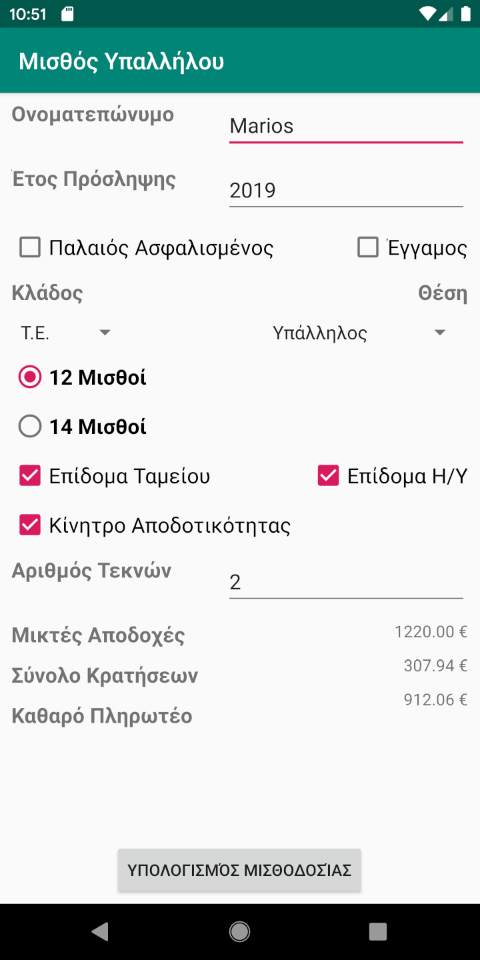

# Greek Employee Salary
This program calculates the salary of an Greek employee.
This is amateur work. 
I made this to learn a little bit about Android Studio & Java.
Not recommended for profesional use.

Να γραφεί κώδικας ο οποίος εισάγει τα παρακάτω στοιχεία:

* Ονοματεπώνυμο υπαλλήλου, Έτος Πρόσληψης
* Κατηγορία Ασφαλισμένου (Παλαιός – πριν το ’93 ή Νέος – μετά το ’93), Έγγαμος ή όχι,
* Κλάδος Υπαλλήλου (ΥΕ, ΔΕ, ΤΕ, ΠΕ, MSc, PhD),
* Θέση Ευθύνης Υπαλλήλου (Υπάλληλος, Προϊστάμενος, Τομεάρχης, Υποδ/ντης, Δ/ντης),
* Πλήθος μισθών ετησίως (12 ή 14),
* Δικαίωμα λήψης επιδομάτων (Ταμείου, Η/Υ, Κίνητρο Αποδοτικότητας),
* Αριθμός τέκνων.
* Υπολογίζει τα παρακάτω :
* Επίδομα Γάμου = 59€ (Το λαμβάνουν μόνο οι έγγαμοι).
* Επίδομα Ταμείου = 250€.
* Επίδομα Η/Υ = 120€.
* Κίνητρο Αποδοτικότητας = 90€.
* Χρονοεπίδομα = 2% επί του Βασικού Μισθού για κάθε συμπληρωμένη διετία υπηρεσίας.
* Επίδομα τέκνων, Βασικό μισθό και Επίδομα θέσης με βάση τους παρακάτω πίνακες :

| Κλάδος | Βασικός Μισθός |
|--------|---------------:|
| Υ.Ε.	 | 530€			  |
| Δ.Ε. 	 | 600€			  |
| Τ.Ε.	 | 680€			  |
| Π.Ε.	 | 800€			  |
| M.Sc.	 | 950€			  |
| Ph.D.  | 1100€		  |

| Αριθμός Τέκνων | Επίδομα Τέκνων |
|:--------------:|---------------:|
| 1				 | 45€			  |
| 2				 | 80€			  |
| 3				 | 115€			  |
| 4				 | 201€			  |
| 5+			 | 50€ ανά παιδί  |

| Θέση 			  | Επίδομα Θέσης |
|-----------------|--------------:|
| Υπάλληλος		  | 0			  |
| Προϊστάμενος	  | 110			  |
| Τομεάρχης		  | 180			  |
| Υποδιευθυντής   | 220			  |
| Διευθυντής      | 300           |

* Κρατήσεις ΙΚΑ = 18,5% επί των μικτών αποδοχών για τους Παλαιούς Ασφαλισμένους, 15,5% για τους Νέους.
* Φόρο Μισθωτών Υπηρεσιών και Εισφορά Αλληλεγγύης με βάση τους παρακάτω πίνακες :

| Ετήσιο Εισόδημα 	| Ποσοστό Φόρου |
|:-----------------:|:-------------:|
| 0 - 20000	  	  	| 22% 		 	|
| 20000,01 - 30000  | 29%		 	|
| 30000,01 - 40000  | 37%			|
| 40000,01 - 65000  | 7,5%			|
| 65000,01 - 220000 | 9%			|
| Υπερβάλλον		| 10%			|

Το ποσοστό του ΦΜΥ βαρύνει το εισόδημα κλιμακωτά, ενώ η εισφορά αλληλεγγύης το βαρύνει στο σύνολό του.
Και τα δύο παραπάνω θα πρέπει να αναχθούν σε μηνιαία βάση

Σύνολο Κρατήσεων = Κρατήσεις ΙΚΑ + ΦΜΥ + Εισφορά Αλληλεγγύης
Καθαρό Πληρωτέο = Μικτές Αποδοχές – Σύνολο Κρατήσεων
